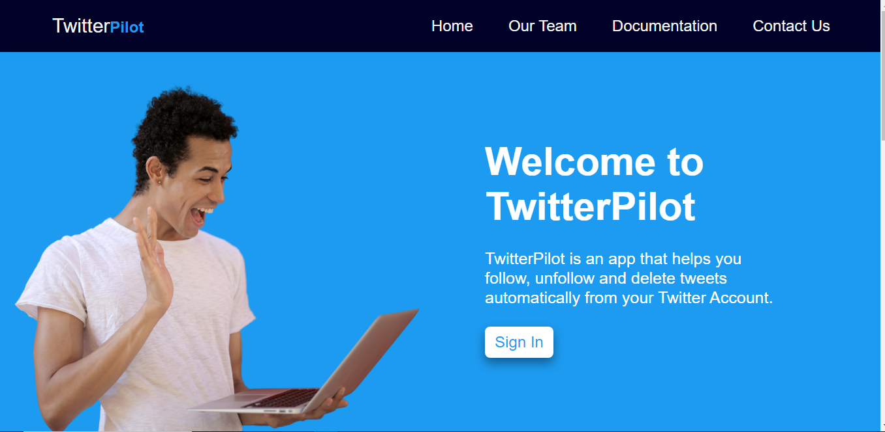
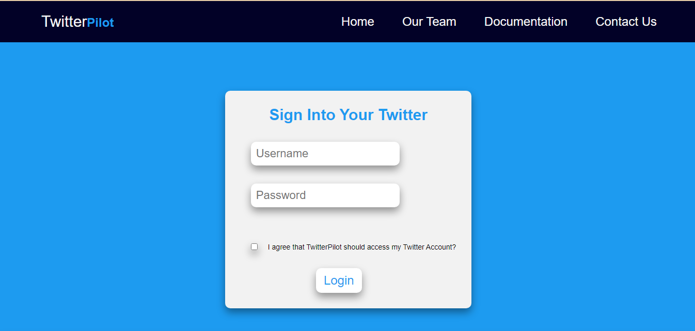
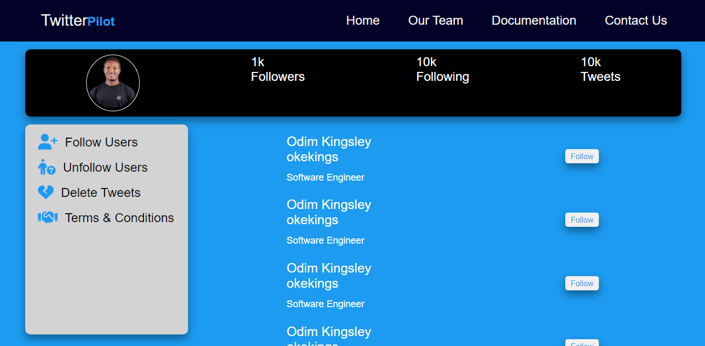

# TwitterPilot Web App

This web app is made to solve the problem of user on Twitter for automatic following accounts, unfollowing accounts and deleting tweets automatically between a period of time frame.

This idea comes as a result of Twitters Users finding it difficult grow their followers (audiences) on the platform. To perform all of these manually can be so overwhelming and our app has come with the solutions to this challenge.

This project is our team final project for specialization during ALX Software Engineering Program, hence, it is still under development and will keep improving over time.

# To access the web app
To access this web app, first type the domain name on your browser then press Enter key or go button and straightway, you will have the welcome landing page open to you as seen in the snapped shot below:

Here, you will be presented with:
. The welcome note 
. A sign in button 
. The team short profile

# To login 
Click on the sign in button on the landing page and your browser will redirect you to the login page where after inserting your Twitter username and login, you must accept our terms and conditions by checking the checkbox before the login button will be enable.

On clicking on the login button, the app will redirect to allow the app access your Twitter profile which you much click on "Allow Access" and this will only be when all the input fields are filled correctly.

# Features and Functionality
Upon successful login and access to your Twitter account, you have all the access to use the features and functionality therein.

# To follow Users
- Click on follow link by the left hand side of the page and automatically, it will start following the followers of the selected account.

# To unfollow Users
- Click on Unfollow link by the left hand side of the page and automatically, it will start unfollowing your followings.

# To delete tweets
- Tap on the delete tweet by the left hand side of the page and it will load all your tweets from the latest and start deleting 
- You can also select time frame within which the tweets should be deleted

## Authors

- [@Odim Kingsley](https://www.github.com/okekingscodes)
- [@Goodness Mbakara](https://www.github.com/Goodnessmbakara)

